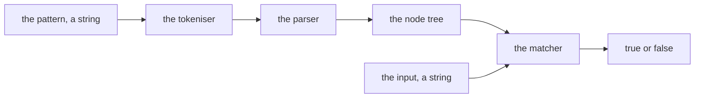
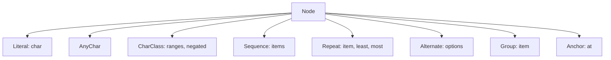

# rex: a regular expression engine

Written 2026-09-05. The operator approved the five step path before this document was written.

## 1. What this is, and why it exists

rex matches a string against a pattern. It parses the pattern into a tree, then walks that tree
against the input. No library does the matching.

The product is small on purpose. It exists to drive Quay Krewe end to end. A project carries a design, and the design carries a
numbered path. A session that starts holding both delivers every step. A regular expression engine suits that because it has no input or output, no database
and no external service. Every step is provable in milliseconds.

## 2. The riskiest assumption

That a session with no other context can take a step of this size. And that each step lands as one
reviewable pull request. If a step needs somebody to explain it, the step is wrong, not
the session.

## 3. Requirements

### 3.1 Functional

A caller can do four things.

1. Test whether a pattern matches a string.
2. Read where in a pattern a syntax error is.
3. Use the dot, character classes, quantifiers, groups, alternation and the anchors.
4. Import the engine as a module.

### 3.2 Non functional

- Every public function carries a type. `strict` is on, and so is `noUncheckedIndexedAccess`.
- No dependency does the matching. Test and build tools are the only dependencies.
- A match of a pattern under 100 characters against an input under 1000 characters returns in under
  one millisecond.
- Every step ships its own tests. A step with no test does not merge.

### 3.3 Constraints

- TypeScript, run on Node 22 or later.
- One package. No workspace, no monorepo.
- The pipeline typechecks, tests and lints on every push.

### 3.4 Out of scope

Captured groups read back by the caller, named groups, lazy quantifiers, back references, lookaround,
Unicode property classes, and case insensitive matching. Each is a later path.

## 4. Technical decisions

**A tree, not a state machine.** The pattern parses to a tree and the matcher walks it with
backtracking. A state machine is faster and it is one large step that cannot be split. The tree
splits into five, and each step adds one node kind. Speed is not a requirement here, and the
non functional target above is met by a tree at these sizes.

**Backtracking, and its cost stated.** A pattern such as `(a+)+b` against a long run of `a`
characters takes exponential time. That is accepted, and it is why lazy quantifiers and back
references are out of scope. A later path can add a step limit.

**A parse failure names a position.** The error carries the index in the pattern and what was
expected. A bare throw makes the caller guess.

**One file per node kind, one test file beside it.** The path adds node kinds one at a time, so the
files stay small and two steps rarely touch one file.

## 5. Architecture

The tokeniser reads the pattern into tokens. The parser builds a tree from the tokens. The matcher
walks the tree against the input and answers.

## 6. The types, at field level

Every node carries a `kind`. The matcher reads `kind` and nothing else to decide what to do.

- `Literal` carries `char`, one string of length 1. It matches that character.
- `AnyChar` carries nothing. It matches one character.
- `CharClass` carries `ranges`, an array of `{ from, to }` where each is a string of length 1, and
  `negated`, a boolean. A single character in a class is a range whose `from` and `to` are equal.
- `Sequence` carries `items`, an array of nodes, matched in order.
- `Repeat` carries `item`, a node, `least`, a number, and `most`, a number or the word `many`. Star
  is 0 and `many`. Plus is 1 and `many`. Question mark is 0 and 1.
- `Alternate` carries `options`, an array of nodes. The first option that matches wins.
- `Group` carries `item`, a node. It groups and captures nothing, because captures are out of scope.
- `Anchor` carries `at`, either `start` or `end`.

The public surface is two functions and one error type.

- `match(pattern: string, input: string): boolean`. It parses, then matches. It throws `ParseError`
  on a bad pattern.
- `parse(pattern: string): Node`. It answers the tree, so a test can read the shape.
- `ParseError` carries `message`, and `index`, the position in the pattern.

A step adds node kinds to this list. It never renames one.

## 7. The path

Five steps. Each one is a single intention and one reviewable pull request. Each one is revertable on
its own. Each one is written for somebody who was not in this conversation.

**Step 1. The harness.**
- Touches: `package.json`, `tsconfig.json`, `vitest.config.ts`, `eslint.config.js`,
  `.github/workflows/ci.yml`, `src/index.ts`, `src/index.test.ts`.
- Changes: a package with strict TypeScript, vitest, a linter, and a pipeline that typechecks, tests
  and lints on every push. `src/index.ts` exports `match`, which throws "not built yet".
- Proves it: the pipeline runs and is green. One test asserts the export exists.
- Depends on: nothing.

**Step 2. Literals and the dot.**
- Touches: `src/node.ts`, `src/parse.ts`, `src/match.ts`, `src/index.ts`, and a test file beside each.
- Changes: `Literal`, `AnyChar` and `Sequence`. The parser reads plain characters and the dot. A
  backslash escapes the next character, so `\.` is a literal dot. `ParseError` arrives here, thrown
  when a pattern ends on a backslash.
- Proves it: `match("abc", "abc")` is true. `match("a.c", "abc")` is true. `match("a.c", "ac")` is
  false. A pattern ending on a backslash throws with `index` at that backslash.
- Depends on: step 1.

**Step 3. Character classes.**
- Touches: `src/node.ts`, `src/parse.ts`, `src/match.ts`, and their test files.
- Changes: `CharClass`. The parser reads `[abc]`, a range `[a-z]`, and negation `[^abc]`. An
  unclosed class throws with the position of the opening bracket.
- Proves it: `[a-z]` matches one lower case letter and nothing else. `[^abc]` matches `d` and not
  `a`. An unclosed class throws at the right index.
- Depends on: step 2.

**Step 4. Quantifiers.**
- Touches: `src/node.ts`, `src/parse.ts`, `src/match.ts`, and their test files.
- Changes: `Repeat`. Star, plus and question mark apply to the item before them. The matcher
  backtracks, so `a*a` matches `aa`. A quantifier with nothing before it throws.
- Proves it: `a*` matches the empty string. `a+` does not. `a*a` matches `aa`, which only a
  backtracking matcher answers. A leading star throws at index 0.
- Depends on: step 3.

**Step 5. Groups, alternation and anchors.**
- Touches: `src/node.ts`, `src/parse.ts`, `src/match.ts`, and their test files.
- Changes: `Group`, `Alternate` and `Anchor`. Parentheses group, so `(ab)+` repeats the pair. The
  vertical bar chooses. `^` and `$` bind the match to the start and the end. An unclosed group
  throws with the position of the opening parenthesis.
- Proves it: `(ab)+` matches `abab`. `a|b` matches both. `^abc$` matches `abc` and not `xabc`. An
  unclosed group throws at the right index.
- Depends on: step 4.

## 8. What proves the whole thing

A step is done when its own tests pass, the typecheck passes, the linter reports nothing, and the
pipeline is green on its pull request. A test that never fails proves nothing. So each step mutates one load bearing line and watches a
test go red. It then restores the line and watches the test go green again.

## 9. Deferred

Captured groups, named groups, lazy quantifiers, back references and lookaround. Unicode property
classes and case insensitive matching. A step limit against exponential patterns, and a command line
entry point.
